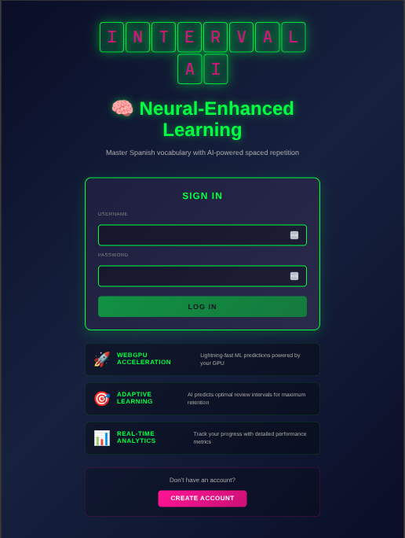
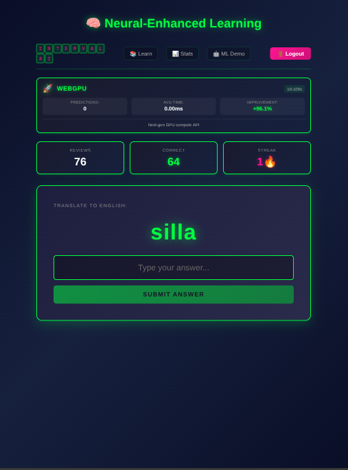

# Spaced Repetition Capstone

A full-stack spaced repetition learning application with machine learning-enhanced algorithm and TensorFlow.js integration.

## Build Status

**Server (Express API with ML)**
- [](https://github.com/maxjeffwell/spaced-repetition-capstone-server/actions/workflows/ci.yml) Continuous Integration
- [](https://github.com/maxjeffwell/spaced-repetition-capstone-server/actions/workflows/docker-build-push.yml) Docker Build & Push

**Client (React SPA)**
- [](https://github.com/maxjeffwell/spaced-repetition-capstone-client/actions/workflows/ci.yml) Continuous Integration
- [](https://github.com/maxjeffwell/spaced-repetition-capstone-client/actions/workflows/docker-build-push.yml) Docker Build & Push

## Architecture

### Backend
- **Framework**: Express.js 5.1.0
- **Database**: MongoDB Atlas
- **Authentication**: Passport.js with JWT
- **ML**: TensorFlow.js for spaced repetition optimization
- **Port**: 8080

### Frontend
- **Framework**: React 18.3.1
- **State Management**: Redux + Redux Thunk
- **ML**: TensorFlow.js with WebGPU acceleration
- **Visualization**: Chart.js and D3.js
- **Port**: 3000 (dev) / 80 (production)

### Infrastructure
- **Reverse Proxy**: Nginx
- **Containerization**: Docker & Docker Compose
- **Orchestration**: Kubernetes (K8s manifests included)
- **CI/CD**: GitHub Actions
- **Registry**: Docker Hub

## Docker Images

Pre-built multi-platform images (linux/amd64, linux/arm64):
- `maxjeffwell/spaced-repetition-capstone-server:latest`
- `maxjeffwell/spaced-repetition-capstone-client:latest`

## Quick Start

### Using Docker Compose

1. **Clone the repository**:
```bash
git clone <repository-url>
cd spaced-repetition-capstone
```

2. **Configure environment**:
```bash
cp .env.example .env
# Edit .env with your MongoDB Atlas connection string and JWT secret
```

3. **Start services**:
```bash
docker-compose up -d
```

4. **Access the application**:
- Application: http://localhost
- API: http://localhost/api
- Health check: http://localhost/health

### Local Development

See [DOCKER.md](DOCKER.md) for detailed Docker usage instructions.

## Deployment

### Production (Kubernetes)

The application runs on a self-hosted **K3s cluster** managed via ArgoCD GitOps:

- **Live:** [intervalai.el-jefe.me](https://intervalai.el-jefe.me)
- **Ingress:** Traefik with automatic TLS via cert-manager + Let's Encrypt
- **Secrets:** Doppler + External Secrets Operator
- **CI/CD:** GitHub Actions → Docker Hub → ArgoCD auto-sync
- **Helm:** Deployed via shared `portfolio-common` library chart

See [KUBERNETES.md](KUBERNETES.md) for detailed Kubernetes deployment guide.

## CI/CD

See [CICD.md](CICD.md) for GitHub Actions configuration and Docker Hub integration.

## Documentation

- [DOCKER.md](DOCKER.md) - Docker Compose usage and troubleshooting
- [KUBERNETES.md](KUBERNETES.md) - Kubernetes deployment on Linode LKE
- [CICD.md](CICD.md) - CI/CD pipeline configuration

## Features

- **Spaced Repetition Algorithm**: SM-2 baseline with ML-enhanced optimization
- **Machine Learning**: TensorFlow.js predicts optimal review intervals
- **A/B Testing**: Compare baseline vs ML algorithm performance
- **Progress Tracking**: Comprehensive statistics and visualizations
- **Client-Side ML**: WebGPU-accelerated inference in the browser
- **Real-time Stats**: Live progress tracking with Chart.js and D3.js

## Screenshots

### Homepage


### Login


### Dashboard


### Learning Session


### Statistics


### Progress Tracking


## License

MIT
